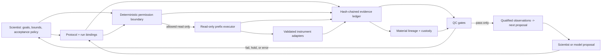

# autonomous-lab

[](https://github.com/di-omics/autonomous-lab/actions/workflows/ci.yml)

**An evidence-bound laboratory-intelligence layer for autonomous biology.**

The package turns a protocol, acceptance criteria, and failure responses into a gated,
auditable run across hardware a lab already owns. It keeps the physical and scientific
worlds synchronized: what material exists, where it came from, what the instruments
actually did, whether the evidence clears QC, and what experiment should be proposed
next.

The governing boundary is simple:

> A model may propose. Only deterministic evidence and permission gates may advance.

The repository provides five connected layers:

1. **Execution truth** - compute which steps are automated, supervised, written,
   manual, blocked, or broken from real command maps and run cards.
2. **Tamper-evident provenance** - append-only, SHA-256-chained run events with explicit
   modeled, simulated, measured, or hardware-validated evidence.
3. **Sample lineage** - immutable material registration, splits, pools, moves,
   measurements, status, and root-to-result traceability.
4. **Scientific permission** - deterministic QC rules that hold on missing data, weak
   evidence, or unit drift.
5. **Closed-loop learning** - bounded process proposals trained only on
   provenance-linked, QC-qualified observations. Proposals never carry execution
   permission.

Research use only. Nothing here is clinically validated.

## Run the complete device-free loop

```bash
pip install 'autonomous-lab @ git+https://github.com/di-omics/autonomous-lab'

autonomous-lab demo-loop --evidence evidence-demo.jsonl
autonomous-lab verify evidence-demo.jsonl
autonomous-lab trace evidence-demo.jsonl demo_process_learning output_a
```

The deterministic demo:

- registers one source material and derives four process outputs;
- records output quality, process variation, and objective measurements;
- passes three outputs through an explicit QC policy;
- quarantines one mechanical fault from model training;
- proposes a bounded next design from the three qualified observations;
- writes 36 hash-chained events; and
- records `execution_allowed: false` on the model proposal.

Synthetic execution inputs and observations are labeled `simulated_execution`; the
derived proposal is labeled `modeled`. Neither is reported as a physical measurement.
The deterministic demo requires a fresh evidence file and refuses a nonempty ledger
before appending anything.

## Architecture



The autonomy ledger and evidence spine share the same execution guardrails; neither
provides a path around deterministic permission checks.

See [the architecture](docs/architecture.md), [the evidence model](docs/evidence-model.md),
and [the first pilot plan](docs/pilot.md).

## What the lab can honestly do today

With the current `plr-reverse-engineer` maps, a real `plr-tested` checkout wired in, and
run-specific AVITI endpoint/folder values still unbound, the 18-step reference laboratory
flow costs as:

| Verdict | Steps | Meaning |
| --- | ---: | --- |
| automated | 1 | USB discovery enumerates candidate serial links headlessly |
| supervised | 2 | operation-specific run cards exist; a human remains present |
| written | 1 | the run card is dry-clean but has never run wet |
| blocked | 10 | eight command-map steps plus two missing runtime bindings |
| manual | 3 | physical loading or an operation with no validated run card |
| broken | 1 | the Tecan read card ran on hardware and failed deterministically |

**An unattended run reaches step 1 of 18 before it stops.** There are also five physical
plate hops that decoding cannot remove.

Network probes are blocked when no endpoint is configured; malformed or unreachable
endpoints fail the armed preflight. Decoded map commands remain supervised because a map
cannot independently prove what its bytes do. Both boundaries are covered by tests. The
live CLI remains the source of truth:

```bash
autonomous-lab stock
autonomous-lab ledger single_cell_genomics --plr-tested ../plr-tested
autonomous-lab gaps
autonomous-lab doctor --plr-tested ../plr-tested
autonomous-lab run single_cell_genomics
```

For every operation this package calls validated, `doctor` confirms the run card exists
in the configured checkout and that its confirmation token appears in the script. It
exits non-zero on drift.

## The evidence contract

Every event declares one of four origins:

| Level | Meaning |
| --- | --- |
| `modeled` | computed or generated; no simulated or physical observation |
| `simulated_execution` | produced by a device or process simulator |
| `measured` | read from the physical world |
| `hardware_validated` | measured through a separately validated integration |

Each JSONL event contains a sequence number, run identifier, actor label, event kind,
payload, previous hash, and its own hash. Mutation, interior deletion, insertion, and
reordering break verification. Removing an unanchored tail changes the head but requires
an external expected head to detect. Raw reader files, images, and omics matrices stay
outside the ledger; measurement events may carry their SHA-256 digests.

Executor run starts also seal protocol and workcell digests, the relevant ProtocolMaps,
the autonomous-lab and plr-re source identities, and the exact external run-card files consulted
while costing federated capability claims.

The chain is tamper-evident, not a signature or identity system. A production deployment
should sign and externally anchor chain heads and add authentication, authorization, and
electronic-signature policy.

The machine-readable event contract is in
[`schemas/evidence-event.schema.json`](schemas/evidence-event.schema.json).

## The sample contract

Protocol `Artifact` objects remain logical types. Per-run `Material` instances carry:

- a material ID and biological sample ID;
- type, amount, unit, container, well/position, and location;
- immutable parent material IDs;
- status: active, quarantined, released, consumed, or disposed;
- measurements with units, evidence level, source event, and optional source-file hash.

Splits and pools form a material graph. Moves and status changes are events, so current
state and complete ancestry are projections of evidence rather than mutable rows. Every
derivation records the quantity allocated from each parent. Conservative transfers
cannot create quantity or cumulatively overdraw a parent; yield-gaining transformations
must be labeled explicitly with a scientific reason. Multi-sample pools receive a new
sample identity.

## The learning contract

`EvidenceBoundOptimizer` provides a deterministic, stdlib-only advisory baseline:

- real-unit parameter bounds are validated before use;
- quarantined observations remain visible but never train the surrogate;
- observations below the configured evidence floor are excluded;
- gate policies, threshold math, run/material links, and source measurements are
  revalidated when an observation is replayed for training;
- scientific feasibility comes from separately sealed boolean constraint attestations;
  the optimizer validates their IDs, evidence, freshness, and `0`/`1` label consistency
  but does not invent or recompute the upstream scientific rule;
- policy and training-set digests are recorded on every proposal;
- duplicate candidate designs and proposal IDs are refused;
- uncertainty and feasibility are explicitly marked heuristic and uncalibrated; and
- every proposal is written with `execution_allowed: false`.

This makes the integration seam real without laundering a toy optimizer into a safety
claim. A production GP/BO or conformal model can replace the proposer behind the same
contract. It still cannot bypass protocol validation, scientific QC, physical readiness,
or human authorization.

## The autonomy ledger

The autonomy ledger derives its claims rather than trusting labels:

- instrument inventory comes from `plr_re.protocolmap.SEEDS`;
- command-map structure and immutable actuation labels are checked against the seed, but
  even a complete map remains supervised because it cannot approve its own request bytes;
- a federated step is supervised only when the exact operation's entry, run card, and
  confirmation token resolve in the configured checkout;
- `doctor` checks run-card paths and confirmation tokens against `plr-tested`;
- execution never skips past the first unsupported step; and
- physical handoffs stay visible outside the autonomy percentage.

The reverse-engineering queue is ranked by complete instrument maps because plr-re's
coverage gate is all-or-nothing:

```bash
autonomous-lab gaps
```

At the current map state, Namocell is first because completing its map frees five steps.

## Safety boundary

`run --armed` is a deliberately narrow name inherited from plr-re. In this package it
can perform only built-in zero-decode reads such as USB enumeration, socket probes, and
run-folder reads. It never transmits a request derived from a ProtocolMap, even when the
map labels that command non-actuating. The built-in HTTP service probe does issue a
read-only `GET /` to a configured endpoint after its socket opens; it sends no
state-changing request. There is no CLI flag in this repository that moves liquid,
heats, opens a tray, starts a sort, or begins a sequencing run. Physical actuation
remains in validated instrument-specific systems with their own guards and an operator
present.

## Repository map

```text
autonomous_lab/
  model.py       protocol-level types and verdict vocabulary
  registry.py    reverse-engineered and federated instrument truth
  workcell.py    local bench configuration and map resolution
  ledger.py      static autonomy costing and reverse-engineering priorities
  executor.py    stop-at-first-boundary read-only execution
  evidence.py    append-only hash-chained run events
  samples.py     material identity, measurements, custody, and lineage
  gates.py       deterministic evidence-aware QC
  learning.py    bounded advisory process proposals
  demo.py        integrated device-free evidence and learning loop
  doctor.py      cross-repository validation-claim checker
  cli.py         reporting, execution, verification, tracing, and demo commands
docs/
schemas/
tests/
```

## Verification

```bash
pip install -e '.[dev]'
pytest -q
ruff check autonomous_lab tests
```

The suite is device-free. Its highest-value tests try to make the system lie: mutate
evidence, truncate a live ledger, reuse a run or sample ID, overdraw or derive from a
quarantined parent, falsify custody, fabricate a gate pass, flip sealed feasibility,
train on a mechanical fault, emit duplicate or out-of-bounds proposals, claim a missing
endpoint is automated, or let a proposal become permission.

CI also runs the CLI, checks federated drift on a schedule, and enforces ASCII source.
