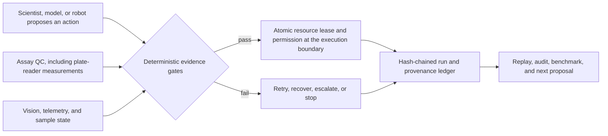

# autonomous-lab

[](https://github.com/di-omics/autonomous-lab/actions/workflows/ci.yml)
[](https://www.python.org/)

**The evidence and decision layer between an AI proposal and a physical laboratory.**

`autonomous-lab` answers two questions without bluffing:

1. How much of this protocol can the workcell execute today, and what exactly blocks the rest?
2. Given assay QC, vision, telemetry, and sample history, is the proposed next action permitted?

It combines an evidence-derived automation ledger, deterministic expert gates, atomic
workcell resource leases, sample provenance, recovery decisions, and throughput
arithmetic. Unsupported actions stop at the boundary. Synthetic demonstrations say they
are synthetic. Hardware claims are checked against the code and run cards that support
them.

Public developer prototype for [Clair](https://clair.bio), built by
[Di Hu](https://reinhaudt.com).

## The control loop


```mermaid
flowchart LR
  A["Scientist, model, or robot proposes an action"] --> D{"Deterministic evidence gates"}
  B["Assay QC, including plate-reader measurements"] --> D
  C["Vision, telemetry, and sample state"] --> D
  D -->|pass| E["Atomic resource lease and permission at the execution boundary"]
  D -->|fail| F["Retry, recover, escalate, or stop"]
  E --> G["Hash-chained run and provenance ledger"]
  F --> G
  G --> H["Replay, audit, benchmark, and next proposal"]
```

Models propose. Versioned, assay-specific rules decide. The execution layer still has to
prove that the instrument command exists, is decoded, has a usable transport, and is
allowed to actuate. Every observation and decision can be committed to an append-only
record for replay.

See [Making an existing laboratory AI-native](docs/AI_NATIVE_WORKCELL.md) for the
cross-repository architecture and the role of the overarching domain expert.

## Run it in 30 seconds

```bash
pip install 'autonomous-lab @ git+https://github.com/di-omics/autonomous-lab'

# A fully passing synthetic QC + vision + telemetry decision.
autonomous-lab loop --scenario pass

# A visible plate-pose error selects the encoded recovery and refuses the move.
autonomous-lab loop --scenario vision_error

# Missing instrument telemetry stops rather than guessing physical state.
autonomous-lab loop --scenario missing_evidence

# Lease a camera, plate mover, and sequencer; recover pose; preserve sample state.
autonomous-lab orchestrate --scenario vision_recovery

# A competing task owns the mover, so no evidence adapter or operation is called.
autonomous-lab orchestrate --scenario resource_busy

# Find the bottleneck in an explicitly illustrative capacity model.
autonomous-lab throughput --samples 96

# Cost a real reference workflow against the current instrument maps.
autonomous-lab ledger single_cell_genomics
```

The failure scenarios exit non-zero on purpose, so the same commands work as CI or
orchestration gates rather than presentation-only reports.

Example passing decision:

```text
SYNTHETIC CLOSED-LOOP DEMO - NO HARDWARE CLAIM
proposal: commit library plate to sequencing
policy:   library_commit@1.0.0-demo
decision: CONTINUE

  PASS    library_concentration    5.4 is inside the assay-QC range
  PASS    deck_pose                0.6 mm is inside the vision limit
  PASS    seal_present             camera evidence says the seal is present
  PASS    sequencer_ready          control-plane telemetry says ready

sample location: sequencer_staging
audit chain: VALID - 7 events form a valid chain
```

## Six capability pillars

| Capability | What the code does now | Evidence boundary |
| --- | --- | --- |
| Feedback control and QC | Applies numeric or categorical acceptance gates to plate-reader, assay, or instrument observations; returns continue, retry, recover, escalate, or stop | Demo observations and ranges are synthetic until replaced by a lab-approved policy and live integration |
| Computer vision and error handling | Gates labware pose, seal presence, liquid presence, or other visible state; encodes the exact recovery when a benchmark fails | Vision cannot stand in for non-visible concentration, interlock, or instrument state |
| Workcell orchestration | Atomically leases every camera, robot, instrument, or station a task needs inside one process; checks sample location; bounds retry and recovery; releases resources on every terminal path | Device adapters are injected and keep their own arming boundary; a durable cross-process lease is still owed |
| Throughput | Computes per-stage capacity, setup and handoff overhead, parallel-resource effects, the bottleneck, and a conservative serial upper bound | Every duration is labeled measured or assumed; the bundled example is assumed |
| Sample tracking and provenance | Records registration, derivation, movement, consumption, and lineage in the same hash-chained run record as observations and decisions | Duplicate IDs, impossible derivations, and post-consumption moves are refused |
| Laboratory intelligence | Turns tacit expert judgment into versioned `ExpertPolicy` gates with required evidence sources, rationale, failure action, and recovery | A model cannot waive a gate or promote missing evidence into permission |

## What exists today

### 1. Evidence-derived automation ledger

The reference protocols are costed against the actual `ProtocolMap` objects from
[plr-reverse-engineer](https://github.com/di-omics/plr-reverse-engineer) and the validated
run cards in [plr-tested](https://github.com/di-omics/plr-tested). A protocol author
cannot mark a step automated. Verdicts are computed:

- `automated`: starts and returns a result headlessly today
- `supervised`: real hardware path exists, behind a human confirmation boundary
- `blocked`: the command path exists but its map, endpoint, or transport is incomplete
- `written`: the run card exists and runs dry but has not run wet on the instrument
- `manual`: no code path covers the bench action
- `broken`: code reached the instrument and failed; this is not disguised as unwritten work

With a `plr-tested` checkout wired in, the 18-step single-cell genomics reference flow
currently costs out as:

| Verdict | Steps | Current meaning |
| --- | ---: | --- |
| automated | 3 | two read-only link preflights and the AVITI run-folder read |
| supervised | 2 | STAR whole-genome sequencing preparation dry motion and ODTC cycling, with their real caveats |
| blocked | 8 | undecoded Namocell and AVITI commands |
| written | 1 | STAR cleanup exists and runs dry; wet validation is still owed |
| manual | 3 | cartridge load, library pool, and flow-cell load |
| broken | 1 | the Tecan absorbance path times out and has never returned an OD matrix |

An unattended run reaches **step 1 of 18** before it stops. That prefix is more useful
than the flat 17% autonomy number: an automatable read near the end is unreachable when
an earlier sample transfer never happened. The ledger also reports five physical plate
hops that decoding cannot remove; a person or plate mover must cover them.

### 2. Deterministic QC, vision, and telemetry gates

`autonomous_lab.intelligence` separates evidence sources because they establish different
facts:

- `assay_qc`: concentration, purity, yield, and other non-visible measurements
- `vision`: pose, presence, seal, tip, liquid surface, and visible error state
- `telemetry`: readiness, interlocks, temperatures, pressures, and controller state
- `operator`: explicit human evidence, never silently treated as machine evidence

Missing evidence stops. Evidence from the wrong source stops. A policy can select a
bounded retry or expert recovery for an observed failure, but it cannot soften unknown
physical state.

### 3. Auditable run and sample provenance

`autonomous_lab.provenance` writes each event with its sequence, sample or instrument
subject, action, JSON payload, timestamp, previous event hash, and its own SHA-256 hash.
Replay detects changed payloads, missing records, and reordered events.

`SampleTracker` uses that same ledger for sample identity, parent-child lineage, location,
and consumption. The decision record and the material record therefore share one chain
instead of drifting in separate databases.

### 4. Honest throughput planning

`autonomous_lab.throughput` names the resource that limits samples per hour and includes
setup, transfer, batch size, and parallel instruments. It also keeps a `measured` flag on
every stage. One assumed stage makes the whole report an assumption rather than measured
performance.

This is intentionally a transparent capacity model, not a production scheduler. The
serial upper bound is conservative until safe stage overlap and measured resource timing
are proved.

### 5. Policy-gated workcell orchestration

`autonomous_lab.orchestrator` turns a proposal into one bounded workcell task:

1. verify the sample is available at the location recorded in provenance
2. atomically lease every required resource, or acquire none
3. gather assay, vision, and telemetry evidence
4. evaluate the versioned expert policy
5. call an injected typed operation only after permission
6. retry or recover within explicit budgets, then escalate rather than loop forever
7. move the sample in provenance only after the operation succeeds
8. release every resource on success, stop, escalation, or adapter failure

Within one orchestrator process, the one-driver-per-instrument rule uses the same resource
manager as cameras, movers, robot arms, and stations. A production deployment still
needs a durable inter-process or distributed lease so a second external driver cannot
bypass the in-memory manager. Expected adapter failures are typed as `retryable`,
`recoverable`, or `failed`; untyped results and unexpected exceptions fail closed and
enter the audit chain.

## Instrument control: what is real

The installed `plr-reverse-engineer` registry currently exposes five reverse-engineered
instrument maps with **0 of 45 seeded commands decoded**. That number is low because the
coverage gate is all-or-nothing and refuses incomplete maps. Read-only contact that
works without decoding includes USB enumeration, socket or HTTP probes, and AVITI
run-folder observation.

The federated STAR, ODTC, HHS, and Tecan paths come from `plr-tested`. Run:

```bash
autonomous-lab doctor --plr-tested ../plr-tested
```

The checker currently verifies 17 paths and confirmation-token claims against the real
checkout. It deliberately cannot verify prose about what a human watched in the physical
world, so every evidence string keeps its caveats.

The known plate-reader failure remains first-class: Tecan setup and tray motion passed,
but absorbance fails deterministically at the Y-stage command and has never returned an
OD matrix. That is `broken`, not `manual` and not `automated`.

## CLI

| Command | Purpose |
| --- | --- |
| `autonomous-lab stock` | Show each instrument, role, transport, map coverage, and zero-decode operations |
| `autonomous-lab protocols` | List the end-to-end reference protocols |
| `autonomous-lab ledger NAME` | Cost every step and name the first unsupported boundary |
| `autonomous-lab gaps` | Rank reverse-engineering work by workflow steps freed |
| `autonomous-lab doctor --plr-tested PATH` | Check federated claims against the run-card checkout |
| `autonomous-lab run NAME` | Dry-run scheduling and stop at the first handoff |
| `autonomous-lab run NAME --armed` | Perform only real read-only operations; never actuates |
| `autonomous-lab loop --scenario NAME` | Exercise QC, vision, telemetry, recovery, and audit behavior on synthetic evidence |
| `autonomous-lab orchestrate --scenario NAME` | Exercise atomic workcell locks, bounded retry/recovery, typed driver outcomes, and sample movement |
| `autonomous-lab throughput --samples N` | Report capacity and bottleneck from explicit assumptions |

Reference protocols:

- `single_cell_genomics`: Namocell sort, STAR preparation, ODTC amplification, STAR
  cleanup and pool, plate-reader QC, AVITI sequencing, and run-folder observation
- `small_molecule_qc`: VIAFLO serial dilution, Biotage V-10 solvent removal, and Agilent
  6530 Q-TOF LC/MS

Both include inconvenient physical work. Omitting cartridge seating, plate transfers,
QC, or flow-cell loading would produce a better autonomy score and a worse lab plan.

## Safety invariants

- This package schedules, evaluates, records, and reports. It never actuates.
- `run --armed` is limited to read-only discovery, probes, and run-folder reads.
- Actuation stays in `plr-reverse-engineer`, behind its own `armed` and
  `allow_actuation` switches, with a human present.
- The executor never skips a blocked step to run a later automatable one.
- A workcell task acquires its entire resource set atomically; a conflict calls neither
  its evidence provider nor its operation adapter.
- Sample provenance is checked before resource acquisition and advances only after a
  typed successful outcome.
- Retry and recovery budgets are finite. Exhaustion escalates and leaves the sample at
  its last proven location.
- A decoded command still remains blocked when sibling coverage, endpoint, or transport
  preconditions are incomplete.
- One driver process per instrument is a hard workcell constraint. Competing STAR or
  ODTC clients can cause resource collisions or steal callbacks.
- A model proposal is data. Only a deterministic permission decision can advance a run.

## Tests

```bash
pip install -e '.[dev]'
pytest -q
```

The suite currently contains **99 device-free tests**. The critical tests try to make the
system lie: assert automation for an undecoded command, use vision in place of assay QC,
continue with missing evidence, tamper with a run record, reuse a sample ID, derive from
samples in different locations, double-book a robot, exhaust recovery, hide transfer
overhead, or skip ahead after a stop.

CI runs on Python 3.9 and 3.12, lints with Ruff, and enforces ASCII-only tracked text.

## Near-term validation path

1. Repair or replace the plate-reader integration and bind a lab-approved concentration
   policy to real OD evidence.
2. Benchmark labware pose, seal, tip, and liquid-state vision on labeled bench data, with
   explicit false-accept limits.
3. Persist and sign run ledgers outside process memory; connect sample IDs to the lab's
   existing source of truth.
4. Back resource ownership with a durable cross-process lease, then prove that competing
   driver processes cannot bypass it.
5. Replace illustrative timing with measured stage and handoff data, then validate safe
   overlap across multiple resource-leased tasks.
6. Reproduce one bounded workflow on independently controlled hardware and turn the
   integration into a paid external pilot.
