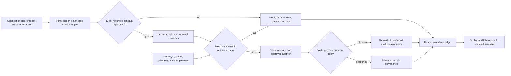

# autonomous-lab

[](https://github.com/di-omics/autonomous-lab/actions/workflows/ci.yml)
[](https://www.python.org/)

Whether a lab can close a loop from hypothesis to evidence, and which leg breaks first.

**The evidence and decision layer between an AI proposal and a physical laboratory.**

`autonomous-lab` answers two questions without bluffing:

1. How much of this protocol can the workcell execute today, and what exactly blocks the rest?
2. Given assay QC, vision, telemetry, and sample history, is the proposed next action permitted?

It combines an evidence-derived automation ledger, deterministic expert gates, reviewed
operation contracts, atomic workcell resource leases, sample provenance, typed recovery,
and throughput arithmetic. Unsupported actions stop at the boundary. Synthetic
demonstrations say they are synthetic. Hardware claims are checked against the code and
run cards that support them.

Public developer prototype for [Clair](https://clair.bio), built by
[Di Hu](https://reinhaudt.com).

## The control loop


```mermaid
flowchart LR
  A["Scientist, model, or robot proposes an action"] --> T["Verify ledger; claim task; check sample"]
  T --> B{"Exact reviewed contract approved?"}
  B -->|yes| C["Lease sample and workcell resources"]
  B -->|no| F["Block, retry, recover, escalate, or stop"]
  C --> D{"Fresh deterministic evidence gates"}
  Q["Assay QC, vision, telemetry, and sample state"] --> D
  D -->|pass| I["Expiring permit and approved adapter"]
  D -->|fail| F
  I --> J{"Post-operation evidence policy"}
  J -->|supported| G["Advance sample provenance"]
  J -->|unknown| K["Retain last confirmed location; quarantine"]
  F --> L
  K --> L
  G --> L["Hash-chained run ledger"]
  L --> H["Replay, audit, benchmark, and next proposal"]
```

Models propose. Versioned, assay-specific rules decide. The execution layer still has to
prove that the instrument command exists, is decoded, has a usable transport, and is
allowed to actuate. Every observation and decision can be committed to an append-only
record for replay.

At protocol scale, execution is only one of four legs. `loop PROTOCOL` separately computes
whether the lab can execute, measure, decide, and record; repairing a driver cannot substitute
for an evaluable assay, a failure detector, or an observed chain of custody.

See [Making an existing laboratory AI-native](docs/AI_NATIVE_WORKCELL.md) for the
cross-repository architecture and the role of the overarching domain expert.

## Run it in 30 seconds

```bash
pip install 'autonomous-lab @ git+https://github.com/di-omics/autonomous-lab@agent/closed-loop-intelligence'

# A fully passing synthetic QC + vision + telemetry decision.
autonomous-lab loop --scenario pass

# A visible plate-pose error selects the encoded recovery and refuses the move.
autonomous-lab loop --scenario vision_error

# Missing instrument telemetry stops rather than guessing physical state.
autonomous-lab loop --scenario missing_evidence

# Lease a camera, plate mover, and sequencer; recover pose; preserve sample state.
autonomous-lab orchestrate --scenario vision_recovery

# A competing task owns the mover, so no evidence adapter or operation is called.
autonomous-lab orchestrate --scenario resource_busy

# A driver timeout after possible motion quarantines the sample instead of replaying it.
autonomous-lab orchestrate --scenario ambiguous_driver_timeout

# Find the bottleneck in an explicitly illustrative capacity model.
autonomous-lab throughput --samples 96

# Cost a real reference workflow against the current instrument maps.
autonomous-lab ledger single_cell_genomics

# Ask which of execute, measure, decide, and record breaks for that protocol.
autonomous-lab loop single_cell_genomics

# Inspect protocol QC, failure detection, vision, provenance, and biological lineage.
autonomous-lab qc single_cell_genomics
autonomous-lab failures single_cell_genomics
autonomous-lab vision
autonomous-lab throughput single_cell_genomics
autonomous-lab provenance single_cell_genomics
autonomous-lab lineage single_cell_genomics
autonomous-lab knowledge
```

The failure scenarios exit non-zero on purpose, so the same commands work as CI or
orchestration gates rather than presentation-only reports.

Example passing decision:

```text
SYNTHETIC CLOSED-LOOP DEMO - NO HARDWARE CLAIM
proposal: commit library plate to sequencing
policy:   library_commit@1.0.0-demo
decision: CONTINUE

  PASS    library_concentration    5.4 is inside the assay-QC range
  PASS    deck_pose                0.6 mm is inside the vision limit
  PASS    seal_present             camera evidence says the seal is present
  PASS    sequencer_ready          control-plane telemetry says ready

sample location: sequencer_staging
audit chain: VALID - 7 events form a valid chain
```

## Six capability pillars

| Capability | What the code does now | Evidence boundary |
| --- | --- | --- |
| Feedback control and QC | Applies numeric or categorical acceptance gates to plate-reader, assay, or instrument observations; returns continue, retry, recover, escalate, or stop | Demo observations and ranges are synthetic until replaced by a lab-approved policy and live integration |
| Computer vision and error handling | Gates labware pose, seal presence, liquid presence, or other visible state; classifies visible, indirectly visible, and physically invisible failures; encodes the exact recovery when a benchmark fails | A detector is not a safety device until its miss rate is measured on held-out real failures; vision cannot stand in for non-visible concentration, interlock, or instrument state |
| Workcell orchestration | Requires an exact contract fingerprint in an in-memory deployment approval registry; derives action scope, budgets, resources, policies, and adapters from it; shares process-wide leases by workcell namespace; issues expiring attempt permits; checks post-operation evidence before provenance can advance | Injected adapters retain their hardware arming boundary and must enforce persistent idempotency at the command boundary; durable cross-process leases and signed/durable approvals are still owed |
| Throughput | Refuses protocol plates-per-day when steps are untimed, and separately computes per-stage capacity, setup and handoff overhead, parallel-resource effects, the bottleneck, and a conservative serial upper bound for an explicitly illustrative plan | Every duration is labeled measured or assumed; the bundled standalone example is assumed |
| Sample tracking and provenance | Records registration, derivation, movement, consumption, uncertainty quarantine, and container lineage in the hash-chained task record; separately traces protocol transforms from a result back to the biological unit | Duplicate IDs, impossible derivations, post-consumption moves, reuse of uncertain samples, and undeclared identity-changing transforms are refused |
| Laboratory intelligence | Turns tacit expert judgment into fingerprinted `ExpertPolicy` gates with required evidence sources, freshness limits, rationale, failure action, and named recovery; records the benchmark a robot must meet before an operation is trusted | A model cannot waive a gate, reuse a policy for an unrelated operation contract, promote missing/stale evidence into permission, or treat an unbenchmarked operation as proven |

## What exists today

### 1. Evidence-derived automation ledger

The reference protocols are costed against the actual `ProtocolMap` objects from
[plr-reverse-engineer](https://github.com/di-omics/plr-reverse-engineer) and the validated
run cards in [plr-tested](https://github.com/di-omics/plr-tested). A protocol author
cannot mark a step automated. Verdicts are computed:

- `automated`: starts and returns a result headlessly today
- `supervised`: real hardware path exists, behind a human confirmation boundary
- `blocked`: the command path exists but its map, endpoint, or transport is incomplete
- `written`: the run card exists and runs dry but has not run wet on the instrument
- `manual`: no code path covers the bench action
- `broken`: code reached the instrument and failed; this is not disguised as unwritten work

With a `plr-tested` checkout wired in, the 18-step single-cell genomics reference flow
currently costs out as:

| Verdict | Steps | Current meaning |
| --- | ---: | --- |
| automated | 3 | two read-only link preflights and the AVITI run-folder read |
| supervised | 2 | STAR whole-genome sequencing preparation dry motion and ODTC cycling, with their real caveats |
| blocked | 8 | undecoded Namocell and AVITI commands |
| written | 1 | STAR cleanup exists and runs dry; wet validation is still owed |
| manual | 3 | cartridge load, library pool, and flow-cell load |
| broken | 1 | the Tecan absorbance path times out and has never returned an OD matrix |

An unattended run reaches **step 1 of 18** before it stops. That prefix is more useful
than the flat 17% autonomy number: an automatable read near the end is unreachable when
an earlier sample transfer never happened. The ledger also reports five physical plate
hops that decoding cannot remove; a person or plate mover must cover them.

`autonomous-lab loop single_cell_genomics` resolves the same protocol into four separate
verdicts: **EXECUTE**, **MEASURE**, **DECIDE**, and **RECORD**. Each broken leg implies a
different intervention. Reverse-engineering repairs execution; a usable assay repairs
measurement; an effective detection path repairs decision; barcodes or a reporting arm
repair custody. One autonomy percentage cannot safely collapse those budgets.

### 2. Deterministic QC, vision, and telemetry gates

`autonomous_lab.intelligence` separates evidence sources because they establish different
facts:

- `assay_qc`: concentration, purity, yield, and other non-visible measurements
- `vision`: pose, presence, seal, tip, liquid surface, and visible error state
- `telemetry`: readiness, interlocks, temperatures, pressures, and controller state
- `operator`: explicit human evidence, never silently treated as machine evidence

Missing, stale, future-dated, malformed, or wrong-source evidence stops. Timezone-aware
timestamps are normalized before choosing the latest observation. A policy can select a
bounded retry or named expert recovery for an observed failure, but it cannot soften
unknown physical state.

The protocol-level diagnostics test whether those inputs exist before claiming supervision:

- `qc PROTOCOL` refuses a gate with a missing measurement and separately flags an
  inappropriate assay, because a number can arrive and still establish the wrong fact.
- `vision` distinguishes visible, indirectly visible, and physically invisible conditions;
  more training data cannot recover information the photons do not contain.
- `failures PROTOCOL` resolves each declared detection path against the actual ledger,
  evaluable gates, and available vision, then exits non-zero while destructive failures
  remain silent.

### 3. Auditable run and sample provenance

`autonomous_lab.provenance` writes each event with its sequence, sample or instrument
subject, action, JSON payload, timestamp, previous event hash, and its own SHA-256 hash.
Replay detects changed payloads, reordering, and deletion from the middle of the available
record. Tail deletion is detectable only when the chain head or event count was committed
externally; this in-memory prototype does not yet provide that external commitment.

`SampleTracker` uses that same ledger for sample identity, parent-child lineage, location,
consumption, and uncertainty. Its public mapping is read-only and exposes immutable
`SampleState` values; later tracker transitions remain visible through that live view. The
decision record and material record therefore share one process-local, in-memory chain
instead of drifting in separate databases. Durable storage and a laboratory source of
truth remain production work.

`provenance PROTOCOL` asks a complementary question about the reference workflow. Its
attestations distinguish `confirmed` instrument reports, `witnessed` human observations,
and `asserted` software intent. Asserted intent is not physical evidence. Its hash links make
edits and splices detectable, but do not make the recorded event true.

Container custody is also not biological identity. `lineage PROTOCOL` traces declared
transforms from a result back to a requested unit such as one cell. It distinguishes
addressed wells, tagged material, bulk material that was never individuated, and material
whose identity was destroyed by merging. Pooling before a durable tag loses attribution
irreversibly; finishing every instrument decode cannot recover it. The report names the
identity linchpin, post-pooling measurements that are blind to one failed well, unobserved
custody hops, and unmeasured terms such as index misassignment. A material-moving step that
does not declare its identity transform is refused instead of assumed to preserve lineage.

### 4. Honest throughput planning

`autonomous_lab.throughput` answers two deliberately different questions. With a protocol,
`throughput PROTOCOL` computes only from measured step durations and returns `NOT COMPUTABLE`
while any required duration is missing; it will not format guesses as plates per day. With
no protocol, `throughput --samples N` runs the standalone illustrative capacity plan, names
the bottleneck, and includes setup, transfer, batch size, and parallel instruments. Every
stage keeps a `measured` flag, so one assumed stage labels the whole report as assumed.

Both paths are transparent capacity models, not production schedulers. The serial upper
bound is conservative until safe stage overlap and measured resource timing are proved.

### 5. Policy-gated workcell orchestration

`autonomous_lab.orchestrator` turns a proposal into one bounded workcell task:

1. verify the ledger, claim a unique task ID, and check the sample's initial provenance
2. require the exact contract fingerprint in the deployment's in-memory approval registry;
   derive locations, budgets, mandatory resources, policies, and adapters from that contract
3. atomically lease the task ID, sample ID, and every required resource, or acquire none;
   enter exclusive `SampleTracker` custody and re-check provenance under both locks
4. bind every `$sample` gate to the task's exact sample and require every other gate subject
   to name a leased resource; then collect fresh, source-appropriate evidence
5. evaluate permission inside the orchestrator's non-injectable deterministic policy engine
6. append operation intent and issue the approved adapter an expiring attempt permit that
   carries a deterministic idempotency key
7. retry only a certified no-sample-state-change result; run only the contract's named,
   versioned recovery, within contract-derived finite budgets
8. detach and validate the typed result, then evaluate sample-bound post-operation evidence
   captured after the operation-completion record
9. re-verify the ledger and evidence freshness immediately before advancing provenance;
   otherwise retain the last confirmed location and record the possible destination while
   quarantining ambiguous sample state
10. release the exact lease generation before appending the terminal task event

Every `ResourceManager` in the same process and `workcell_namespace` shares one ownership
registry across runs and orchestrator instances. The namespace is trusted deployment
configuration that identifies a physical workcell; it must never come from a model or
task payload. Different namespaces intentionally isolate different workcells. A production
deployment still needs a durable inter-process or distributed lease so a separate driver
process cannot bypass this registry.

Policies and operation contracts are fingerprinted into the record alongside adapter ID,
version, configuration hash, permit, idempotency key, and typed result. Approved adapters
must reject expired permits and persistently deduplicate the idempotency key at the hardware
command boundary; the in-memory orchestrator cannot guarantee either after a process crash.
Untyped results, wrong permits, post-operation evidence failures, and unexpected exceptions
fail closed. Any possibly changed sample becomes `uncertain` rather than being silently
reported at the possible destination.

`autonomous-lab knowledge` exposes the other half of expert orchestration: each judgment
states when it applies, what to do, why, what it guards against, its evidence basis, and
whether this lab validated it. Robot operations are untrusted by default until a named
benchmark is met; absence of a measurement is not evidence of adequacy.

## Instrument control: what is real

The installed `plr-reverse-engineer` registry currently exposes five reverse-engineered
instrument maps with **0 of 45 seeded commands decoded**. That number is low because the
coverage gate is all-or-nothing and refuses incomplete maps. Read-only contact that
works without decoding includes USB enumeration, socket or HTTP probes, and AVITI
run-folder observation.

The federated STAR, ODTC, HHS, and Tecan paths come from `plr-tested`. Run:

```bash
autonomous-lab doctor --plr-tested ../plr-tested
```

The checker verifies cited run-card paths and confirmation tokens, then cross-checks every
modelled operation against `plr-tested/evidence/manifest.json`: status, run card, token, and
manifest coverage. The manifest is the instrument-owning repository's machine-readable
record of what met hardware under its own CI rules. A missing manifest or disagreement is a
failure, not a skipped check; the repository with the instrument wins.

Neither pass can verify whether a human actually watched the physical run. That claim stays
narrow prose with its caveats: a hash-linked manifest can detect drift, not manufacture
physical evidence.

The known plate-reader failure remains first-class: Tecan setup and tray motion passed,
but absorbance fails deterministically at the Y-stage command and has never returned an
OD matrix. That is `broken`, not `manual` and not `automated`.

## CLI

| Command | Purpose |
| --- | --- |
| `autonomous-lab stock` | Show each instrument, role, transport, map coverage, and zero-decode operations |
| `autonomous-lab protocols` | List the end-to-end reference protocols |
| `autonomous-lab ledger NAME` | Cost every step and name the first unsupported boundary |
| `autonomous-lab gaps` | Rank reverse-engineering work by workflow steps freed |
| `autonomous-lab doctor --plr-tested PATH` | Check federated claims against the run-card checkout |
| `autonomous-lab run NAME` | Dry-run scheduling and stop at the first handoff |
| `autonomous-lab run NAME --armed` | Perform only real read-only operations; never actuates |
| `autonomous-lab loop --scenario NAME` | Exercise QC, vision, telemetry, recovery, and audit behavior on synthetic evidence |
| `autonomous-lab loop NAME` | Compute the protocol's execute, measure, decide, and record legs |
| `autonomous-lab qc NAME` | Report whether declared QC gates can be evaluated and whether they use an appropriate assay |
| `autonomous-lab failures NAME` | Resolve failure detection against the evidence paths that actually exist |
| `autonomous-lab vision` | Report visible, indirectly visible, and physically invisible checks |
| `autonomous-lab provenance NAME` | Report confirmed, witnessed, and asserted protocol events plus custody gaps |
| `autonomous-lab lineage NAME` | Trace a result back to a biological unit across declared material transforms |
| `autonomous-lab knowledge` | Show encoded expert judgments and robot-validation benchmarks |
| `autonomous-lab orchestrate --scenario NAME` | Exercise reviewed operation contracts, atomic sample/resource locks, execution permits, typed recovery, postconditions, and provenance |
| `autonomous-lab throughput --samples N` | Report standalone illustrative capacity and its bottleneck from explicit assumptions |
| `autonomous-lab throughput NAME` | Compute measured protocol throughput, or refuse when required timing is absent |

Reference protocols:

- `single_cell_genomics`: Namocell sort, STAR preparation, ODTC amplification, STAR
  cleanup and pool, plate-reader QC, AVITI sequencing, and run-folder observation
- `small_molecule_qc`: VIAFLO serial dilution, Biotage V-10 solvent removal, and Agilent
  6530 Q-TOF LC/MS

Both include inconvenient physical work. Omitting cartridge seating, plate transfers,
QC, or flow-cell loading would produce a better autonomy score and a worse lab plan.

## Safety invariants

- This package contains no hardware driver. `WorkcellOrchestrator` can initiate an
  injected adapter after contract, evidence, lease, and permit checks; that adapter must
  still enforce its hardware-specific arming boundary.
- `run --armed` is limited to read-only discovery, probes, and run-folder reads.
- The portfolio's current hardware-actuation paths stay in `plr-reverse-engineer`, behind
  its own `armed` and `allow_actuation` switches, with a human present. Any other injected
  adapter must enforce an equivalent hardware-specific arming boundary.
- The executor never skips a blocked step to run a later automatable one.
- Mandatory resources come from an exact deployment-approved operation contract, not the proposal. A
  workcell task leases the sample, task ID, and entire resource set atomically; a conflict
  calls neither its evidence provider nor its operation adapter.
- Sample provenance is re-checked under the lease and advances only after a typed result
  and fresh post-operation evidence both pass.
- Retry and recovery budgets are finite. Only a certified no-sample-change result may be
  replayed. Exceptions, wrong permits, and ambiguous effects quarantine the sample at its
  last confirmed location with the possible destination recorded separately.
- A decoded command still remains blocked when sibling coverage, endpoint, or transport
  preconditions are incomplete.
- One driver per instrument is a deployment rule enforced among managers that share one
  in-process workcell namespace. Competing external processes can still collide until a
  durable cross-process lease surrounds the driver boundary.
- A model proposal is data. Only a deterministic permission decision can advance a run.

## Tests

```bash
pip install -e '.[dev]'
pytest -q
```

The suite currently contains **258 device-free tests**. The critical tests try to make the
system lie: assert automation for an undecoded command, use vision in place of assay QC,
continue with stale or missing evidence, misorder timezone offsets, tamper with a run
record, race ledger and sample transitions, reuse a run, sample, task ID, or stale lease,
pair a policy with the wrong operation or sample, omit a mandatory resource, split one
workcell across manager instances, invoke the wrong recovery, accept expired evidence or
permits, mutate returned adapter data, replay ambiguous motion, cancel after possible
actuation, double-book a robot, hide transfer overhead, pass an empty QC gate vacuously,
claim an unavailable detector caught a failure, invent throughput over untimed steps,
report intact lineage through identity-destroying pooling, accept a stale federated
manifest, or skip ahead after a stop.

CI runs on Python 3.9 and 3.12, lints with Ruff, and enforces ASCII-only tracked text.

## Near-term validation path

1. Repair or replace the plate-reader integration and bind a lab-approved concentration
   policy to real OD evidence.
2. Benchmark labware pose, seal, tip, and liquid-state vision on labeled bench data, with
   explicit false-accept limits.
3. Persist and sign run ledgers and contract approvals outside process memory; publish
   chain heads so tail truncation is detectable; connect sample IDs to the lab's existing
   source of truth.
4. Back resource ownership with a durable cross-process lease, then prove that competing
   driver processes cannot bypass it.
5. Replace illustrative timing with measured stage and handoff data, then validate safe
   overlap across multiple resource-leased tasks.
6. Reproduce one bounded workflow on independently controlled hardware and turn the
   integration into a paid external pilot.
