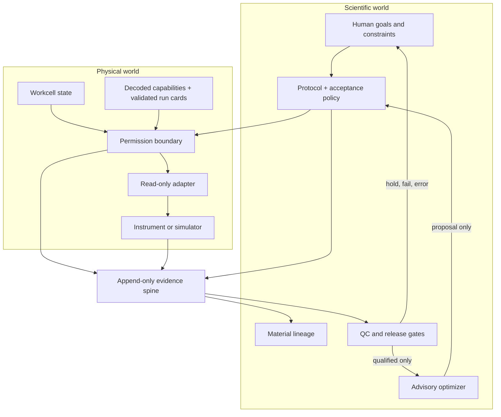
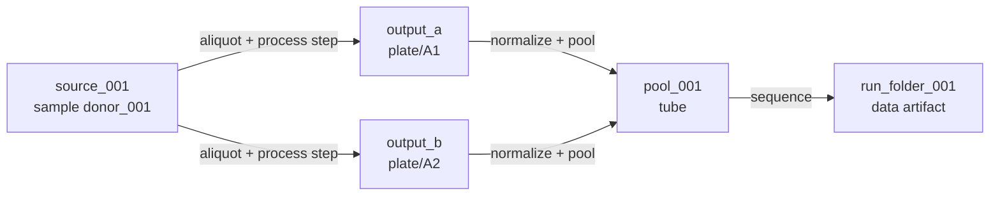

# Laboratory-intelligence architecture

A laboratory-intelligence kernel is not an all-powerful robot agent. It keeps a
scientist's protocol, the current physical state, the available evidence, and the next
decision in one replayable model. The aim is to extend human scientific capacity:
persistent memory across runs, consistent checks under pressure, parallel evidence
synthesis, and faster experiment design without transferring scientific authority to a
language model.

## The two-world model

A useful autonomous lab has to answer two independent questions.

1. **Physical world:** Can this exact action execute safely on the current instruments,
   deck, containers, and samples?
2. **Scientific world:** Is this the right experiment, and is the resulting evidence
   trustworthy enough to advance or learn from?

This repository implements the scientific/evidence spine and a deliberately narrow
read-only physical seam. Instrument-specific repositories retain physical actuation.



## Components

| Module | Responsibility | Explicit non-responsibility |
| --- | --- | --- |
| `model.py` | Logical artifacts, ordered protocol steps, tiers, verdicts | Per-run sample state |
| `registry.py` | Instrument capabilities and operation-specific federated claims | Generic "instrument is validated" inheritance |
| `workcell.py` | Bench presence, map paths, endpoints, external run-card checkout | Discovering or guessing missing configuration |
| `ledger.py` | Cost every step and rank real blockers | Executing or overriding a step |
| `executor.py` | Execute the honest read-only prefix and stop | Actuation or skip-ahead |
| `evidence.py` | Append, seal, verify, and replay run events | Identity, authorization, or raw data storage |
| `samples.py` | Material instances, splits, pools, movement, state, measurements | Protocol-type definitions |
| `gates.py` | Explicit numeric QC against evidence floors | Model-based permission |
| `learning.py` | Bounded, evidence-qualified proposals | Calibrated safety or hardware execution |

## State and evidence

The file-backed ledger is newline-delimited canonical JSON. On Unix, appends and
lock-time domain validation are serialized with `flock`; on platforms without `fcntl`,
a shared JSONL file requires an externally enforced single-writer policy. Every event
contains the previous event hash and a digest of its own body. Domain state is
reconstructed from events.

This has three useful consequences:

- a current sample table can always be traced back to the events that produced it;
- a gate decision names the exact measurement events and policy digest it used; and
- a proposal names the exact qualified observation events, policy, and dataset digest.

An executor run start additionally seals the protocol, workcell, relevant ProtocolMaps,
autonomous-lab/plr-re source identities, and content hashes for every external federated run-card
file consulted during capability costing. A pre/post digest comparison refuses the run
if those external files change during costing.

The ledger stores compact claims and file hashes. Raw FASTQ/BAM files, reader exports,
images, and video belong in an object store or validated filesystem.

## Material graph

`Artifact` answers, "What logical thing does this protocol step consume?" `Material`
answers, "Which physical or data instance exists in this run?"



Parent IDs never change. Location and status changes append events. A pooled material
with multiple biological sample IDs must declare a new sample identity instead of
silently inheriting one parent.

Every derived material also allocates an explicit quantity from every parent. Transfer
events may not produce more than those contributions, and replay rejects cumulative
allocation beyond the parent's recorded quantity. Yield-gaining or unit-changing work
must be labeled as a transformation with a scientific reason; its input allocation is
still conserved and auditable even when output quantity is not.

## Decision boundary

The decision sequence is:

```text
proposal
  -> validate real-unit bounds and protocol shape
  -> resolve current workcell and sample state
  -> evaluate scientific evidence gates
  -> evaluate physical capability and readiness
  -> issue a separately scoped permission
  -> execute through an instrument-specific guarded adapter
  -> record measurement and QC
  -> qualify or quarantine the observation
  -> produce another inert proposal
```

The current repository stops before issuing physical actuation permission. A future
permit should be single-use, short-lived, and bound to:

- run and plan digests;
- instrument/backend and execution mode;
- actor and approver identities;
- current deck, inventory, material, and calibration snapshot;
- exact action scope; and
- expiry and revocation state.

Changing any bound state must invalidate the permit.

## Failure and recovery model

The executor never skips the first non-headless step. A safe resumable version should
distinguish:

- `not_started`;
- `started`;
- `succeeded`;
- `failed`; and
- `uncertain` (the process ended after a physical action may have occurred but before a
  durable acknowledgement).

Only explicitly read-only, idempotent operations should auto-retry. Manual, federated,
actuating, or unknown steps interrupted in flight must become `uncertain` and require
reconciliation evidence.

## Human amplification

The human-centered division of labor is intentional.

Humans own:

- the scientific objective and what counts as success;
- acceptable risk, escalation, and recovery policy;
- interpretation of novel failures;
- validation claims; and
- physical authorization.

Software owns:

- remembering every sample, action, result, and decision;
- checking the same constraints on every run;
- refusing unsupported boundaries consistently;
- ranking bottlenecks across many workflows;
- separating mechanical faults from biology before learning; and
- searching bounded design spaces faster than manual iteration.

This is the path toward laboratory superintelligence that elevates scientists: more
memory, search, precision, and coordination around human judgment, not a replacement for
it.

## Production gaps

The repository intentionally does not claim the following are complete:

- authenticated identities, RBAC, electronic signatures, or non-repudiation;
- external hash anchoring or signed evidence;
- barcode-scanner integration and container occupancy enforcement;
- database/object-store deployment and multi-site replication;
- cross-platform or distributed writer coordination beyond Unix `flock`;
- calibration validity windows;
- one-process resource leases across schedulers;
- crash-safe recovery of ambiguous physical work;
- a full protocol/run manifest compiler;
- a calibrated production surrogate or conformal gate; or
- independent wet-lab validation of the integrated evidence and learning loop.

Those are the next systems milestones, not hidden assumptions.
